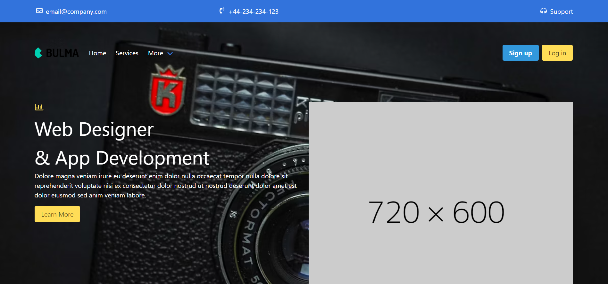

# Udemy Project
Practical Project assignment of building a single front end page website for a Demo company as part of Frontend development course from Udemy using Bulma CSS framework. Click to see the website on [here](https://okenhaha.github.io/companysite_demo/)

